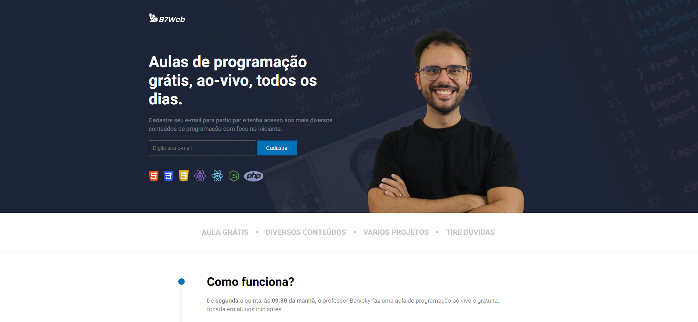

<h1 align="center">
   Página de captura
</h1>
<!--
<h2 align="center">
  Travel to San Francisco Safely
</h2> -->

  

## 💻 Projeto

Esse projeto foi desenvolvido seguindo essa playlist [B7Daily](https://www.youtube.com/watch?v=xxsodfcDQHQ) .

Dependências usadas no projeto:
-  [Html](https://developer.mozilla.org/pt-BR/docs/Web/HTML)
-  [CSS](https://developer.mozilla.org/pt-BR/docs/Learn/CSS)

## Crédito

-  [Youtube - bw7](https://www.youtube.com/watch?v=xxsodfcDQHQ)

# ⌨️ Autores

<table>
  <tr>
    <td align="center">
      <a href="https://github.com/pedroGermano">
        
         
        
          <b>Pedro Germano</b>
        
       </a>
        
       <a href="https://www.linkedin.com/in/pedrogermano232/" title="Linkedin">@pedroGermano</a>
        
       <a href="#" title="Code">💻</a>
    </td>
    <td align="center">
      <a href="https://b7web.com.br/fullstack/">
        
         
        
          <b>Bw7 Bonieky</b>
        
       </a>
        
       <a href="https://www.youtube.com/c/BoniekyLacerdaLeal" title="youtube">@BoniekyLacerdaLeal</a>
        
        <a href="#" title="Code">💻</a>
    </td>
  </tr>
</table>

## 📥 Instalação e execução

Faça um clone desse repositório e acesse o diretório.